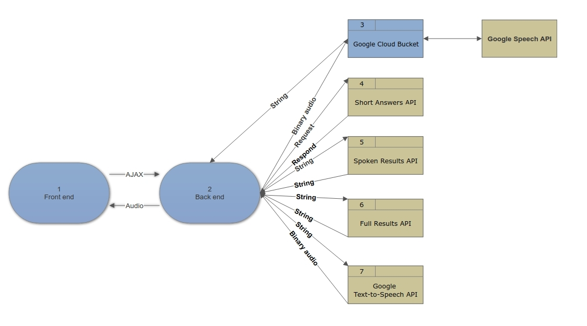

# askme

**Authors**:
- [Peter Kim](https://github.com/seattlechem)
- [Andrii Glukhyi](https://github.com/andriiglukhyi)
- [Ramon Mendoza](https://github.com/brickfaced)

**Version**: 1.0.0

 

## API
<!-- Provide detailed instructions for your applications usage. This should include any methods or endpoints available to the user/client/developer. Each section should be formatted to provide clear syntax for usage, example calls including input data requirements and options, and example responses or return values. -->

## Change Log
<!-- Use this are to document the iterative changes made to your application as each feature is successfully implemented. Use time stamps. Here's an example:

01-01-2001 4:59pm - Added functionality to add and delete some things.
-->
| Date | |
|:--|:--|
| 5-25-2018 | Final Presentation |
| 5-24-2018 | Stuff |
| 5-23-2018 | Stuff |
| 5-22-2018 | Initial setup, install Django, complete rest api |

## Resources
- gitignore.io
- editorconfig.org
- github.com/necolas/normalize.css
- github.com/jiaaro/pydub/
- github.com/pygame/pygame
- github.com/jrief/django-sass-processor
- github.com/voxy/django-audio-recorder

